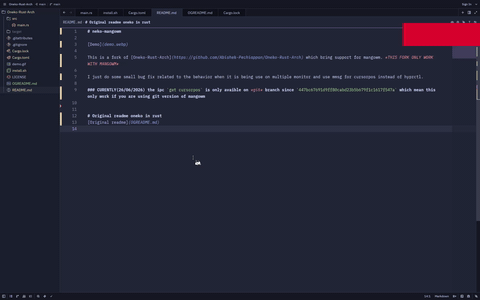

# neko-mangowm



This is a fork of [Oneko-Rust-Arch](https://github.com/Abishek-Pechiappan/Oneko-Rust-Arch) which brings support for mangowm. *THIS FORK ONLY WORKS WITH MANGOWM*

I just made some small bug fixes related to the behavior when it is used on multiple monitors and use `mmsg` for cursor position instead of `hyprctl`.

### CURRENTLY (26/06/2026) the IPC `get cursorpos` is only available on the `git` branch of mangowm since commit `447bc67691d9ff80cabd23b5b679f1c1617f547a`, which means this only works if you are using the Git version of mangowm.

## Install

You will need `cargo` to build.

```bash
git clone https://codeberg.org/Tahoso/oneko-mangowm
cd oneko-mangowm
sudo chmod +x install.sh
./install.sh
```

## Usage

```bash
neko-mangowm [Monitor name]
```

Example: 

```bash
neko-mangowm DP-1
```


# Original readme oneko in rust
[Original readme](OGREADME.md)
